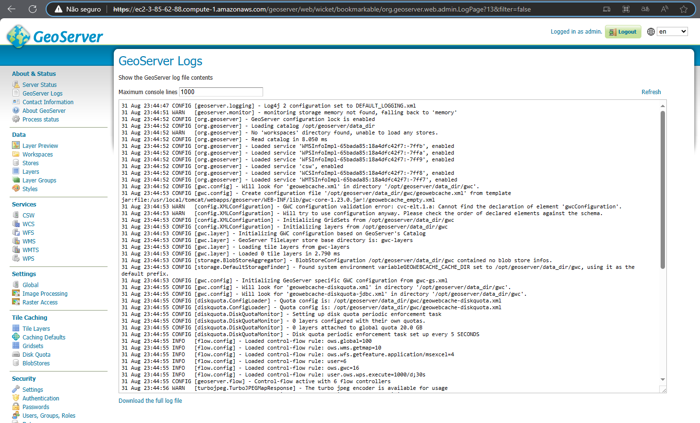

# Documentação do GeoServer com PostGIS

Este documento descreve a configuração e o uso do GeoServer com PostGIS usando Docker Compose. O GeoServer é uma plataforma de código aberto para compartilhamento, processamento e edição de dados geoespaciais.

## Índice

1. [Diferenciais](#diferenciais)
2. [Estrutura de Diretórios](#estrutura-de-diretórios)
3. [Docker Compose](#docker-compose)
   - [Serviço `db`](#serviço-db)
   - [Serviço `geoserver`](#serviço-geoserver)
4. [Scripts](#scripts)
   - [`setup.sh`](#setupsh)
   - [`copy_geoserver_data.sh`](#copy_geoserver_datash)
5. [Variáveis de Ambiente (.env)](#variáveis-de-ambiente-env)
6. [Uso](#uso)
7. [Acesso ao GeoServer](#acesso-ao-geoserver)

## Diferenciais

Este Docker Compose oferece os seguintes diferenciais:

1. **Suporte HTTPS**: O ambiente configurado por este Docker Compose inclui suporte a HTTPS.

2. **Instalação de Plugins**: Além da configuração básica do GeoServer e do PostGIS, este ambiente também permite a instalação de plugins adicionais para estender a funcionalidade do GeoServer conforme necessário.

## Estrutura de Diretórios

O ambiente é organizado da seguinte forma:

 
    /geoserver/geoserver_docker/producao
    |__copy_geoserver_data.sh
    |__docker-compose.yaml
    |__setup.sh
    |__.env

- `setup.sh`: Script para configuração inicial.

- `docker-compose.yaml`: Arquivo de configuração para deploy dos containers.

- `.env`: Arquivo de variáveis de ambiente.

- `copy_geoserver_data.sh`: Script para restauração dos dados contidos Geoserver anterior, conteudo do diretorio data do GeoServer.

## Docker Compose

O arquivo `docker-compose.yaml` define dois serviços principais:

### Serviço `db`

- Imagem: kartoza/postgis:${POSTGIS_VERSION_TAG}
- Container: geoserver_db_prod
- Volume: geo-db-data
- Porta: ${POSTGRES_PORT}:5432
- Variáveis de Ambiente:
  - POSTGRES_DB=${POSTGRES_DB}
  - POSTGRES_USER=${POSTGRES_USER}
  - POSTGRES_PASS=${POSTGRES_PASS}
  - ALLOW_IP_RANGE=${ALLOW_IP_RANGE}
  - FORCE_SSL=TRUE

### Serviço `geoserver`

- Imagem: kartoza/geoserver:${GS_VERSION}
- Container: geoserver_app_prod
- Volume: geoserver-data
- Portas:
    - ${GEOSERVER_PORT}:8080
    - ${GEOSERVER_PORT_HTTPS}8443
- Variáveis de Ambiente:
  - GEOSERVER_DATA_DIR=${GEOSERVER_DATA_DIR}
  - GEOWEBCACHE_CACHE_DIR=${GEOWEBCACHE_CACHE_DIR}
  - Outras configurações do GeoServer no arquivo

## Scripts

### `setup.sh`
Com o objetivo de auxíliar 
Este script realiza todo o processo de criação do ambiente Geoserver se seu ambiente possuir o git, docker e docker-compose instalados

Este script realiza as seguintes etapas:

1. Cria o diretório `/geoserver`.
2. Ajusta as permissões do diretório.
3. Clona um repositório Git (presumivelmente com arquivos de configuração).
4. Inicia o Docker Compose.

### `copy_geoserver_data.sh`

Este script realiza o seguinte:

1. Realisa um stop nos contêineres do GeoServer e do banco de dados.
2. Copia os dados do diretório `/geoserver/geoserver_docker/producao/data_arquivos/` para o volume `geoserver-data`.
3. Ajusta as permissões.
4. Inicia os contêineres novamente.

## Variáveis de Ambiente (.env)

O arquivo `.env` define várias variáveis de ambiente, incluindo informações sobre versões, portas, configurações do GeoServer, configurações do banco de dados e muito mais. Personalize estas variáveis conforme necessário para o seu ambiente.

## Uso

Siga estas etapas para configurar e iniciar o GeoServer com PostGIS:

1. Execute `setup.sh` para preparar o ambiente.
2. Personalize as variáveis de ambiente em `.env` conforme necessário.
3. Execute `docker compose -f docker-compose.yaml up -d` para iniciar os contêineres.

Certifique-se de configurar as variáveis de ambiente corretamente de acordo com as necessidades do seu ambiente.

---

**Nota**: Este é um exemplo de documentação. Certifique-se de verificar e adaptar as configurações para atender aos requisitos específicos do seu ambiente.

## Acesso ao GeoServer

Após configurar o ambiente com sucesso, você pode acessar o GeoServer da seguinte maneira:

1. Abra seu navegador da web.

2. Acesse o GeoServer pelo endereço:

   - Para HTTP: `http://seu_servidor/geoserver`
   - Para HTTPS: `https://seu_servidor/geoserver`

   Certifique-se de substituir `seu_servidor` pelo endereço do servidor onde o Docker Compose está sendo executado. As portas podem variar com base nas configurações definidas no arquivo `.env`. As configurções definidas estão publicando a aplicação pelas portas 80 e 443, é possivel alterar esa configurações `.env` GEOSERVER_PORT e GEOSERVER_PORT_HTTPS respectivamente.

3. Você será direcionado para a página de login do GeoServer. Use as credenciais configuradas nas variáveis de ambiente `GEOSERVER_ADMIN_USER` e `GEOSERVER_ADMIN_PASSWORD` no arquivo `.env`.

4. Após o login bem-sucedido, você terá acesso ao painel de administração do GeoServer, onde poderá gerenciar camadas, configurações, dados e muito mais.

